#### Cocos Creator3.8 帅炸天的全局辉光后效

Creator的3.8版本...泰裤辣！
全局辉光后效，简直帅炸天！
从此网页游戏也能做出AAA级的画面了！
什么手撸WebGL，什么Three.js，什么Babylon.js，
统统自己抱着代码玩去吧~

我就做调参侠了，哈哈！cocos NB！

先看看效果图：
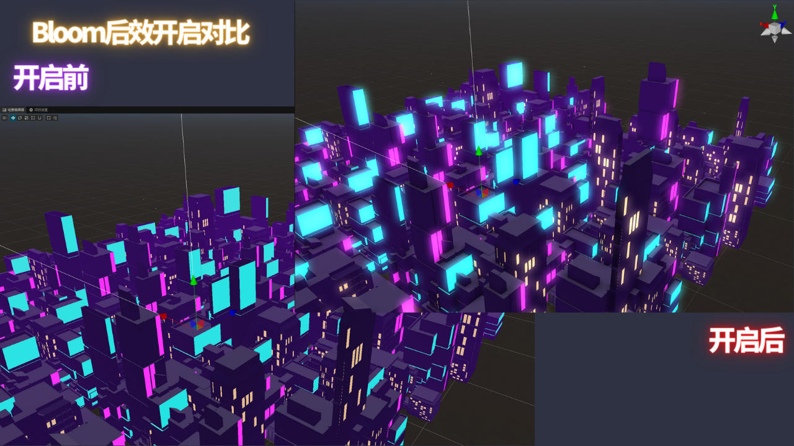
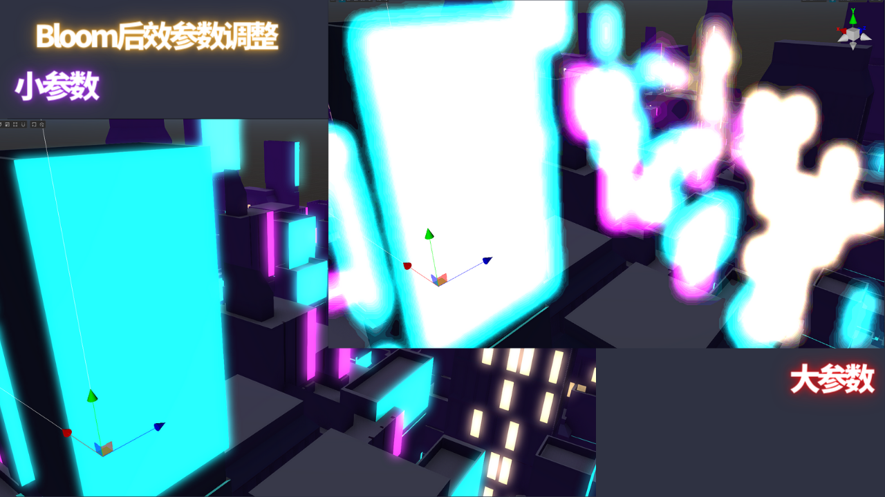

##### 1.Bloom参数使用体验

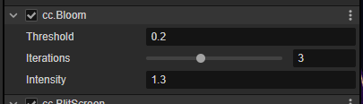

三个参数：Threshold、Iterations、Intensity。
作为一个熟练的调参侠，目前3.8公测版本的体验经验是这样。

Threshold：阈值，直接影响在自发光的颜色与全局光的颜色之间的过渡区域的大小。所以一开始调整觉得效果不好，可能是因为颜色与全局光太大或者太小，降低光强度或者提高光强度，调整阈值，就能看到效果了。

Iterations：迭代次数，迭代次数越多，辉光效果越明显。正常3-4就可以了...目前公测版本调整预览时候可能会卡住，ctrl+R刷新重载一下就好了。

Intensity：光强度，光强度越大，辉光效果越明显。正常0.5-1就可以了。

这三个参数建议配合材质的自发光颜色一起调整。

效果图：

##### 2.HBAO 环境光参数使用体验

AO是经常在3D场景中需要调整的材质属性，一般是用来模拟阴影的，比如在角落里面，或者两个物体靠的很近的地方，会有一些阴影效果。

而我场景里的材质，压根没有AO贴图，但是强大的3.8版本，直接加上了AO效果，而且还是全局的。

效果图：
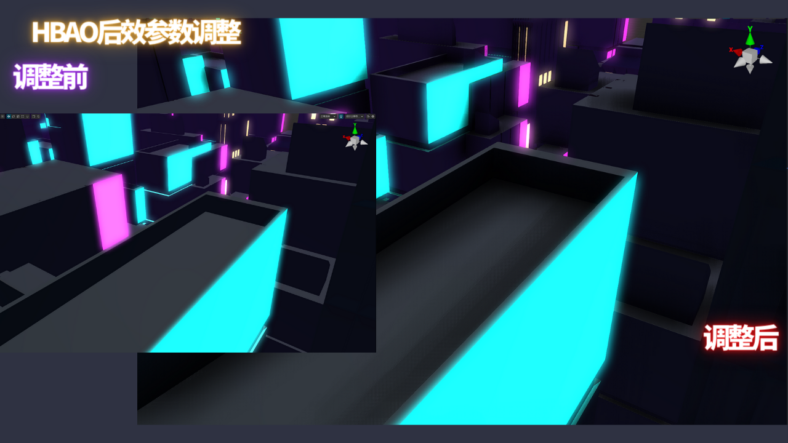

参数：
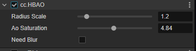

##### 3.好玩的TAA

TAA据说叫抗锯齿，但是作为调参侠的我发现···

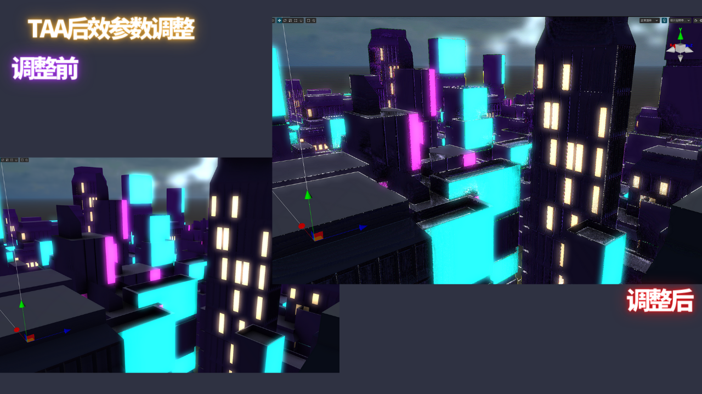

直接风格化成漫画了啊！哈

##### 4.PostProcess开启方法

3.8版本新建项目默认是关闭的，需要在项目设置里面开启。

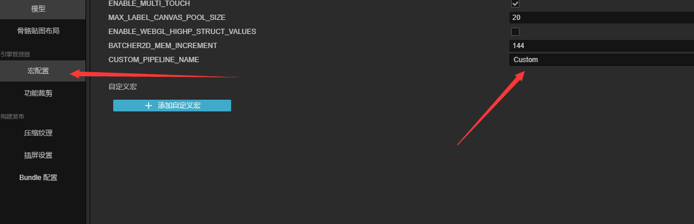
1.宏配置：CUSTOM_PIPLINE_NAME，“Custom”
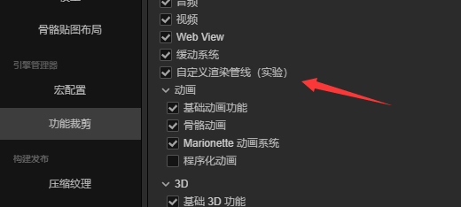
2.功能裁剪：自定义渲染管线（开启）
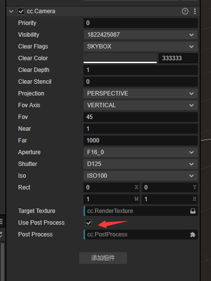
3.项目中的摄像头需要勾选UserPostProcess为True
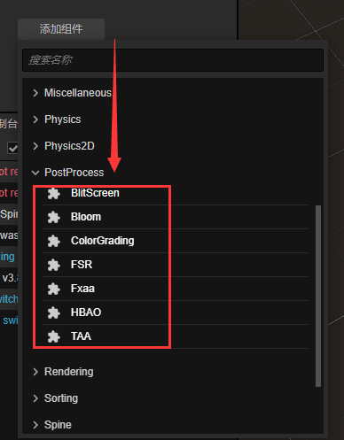
4.对象池中随便新建一个空节点，添加PostProcess组件。
像这样：
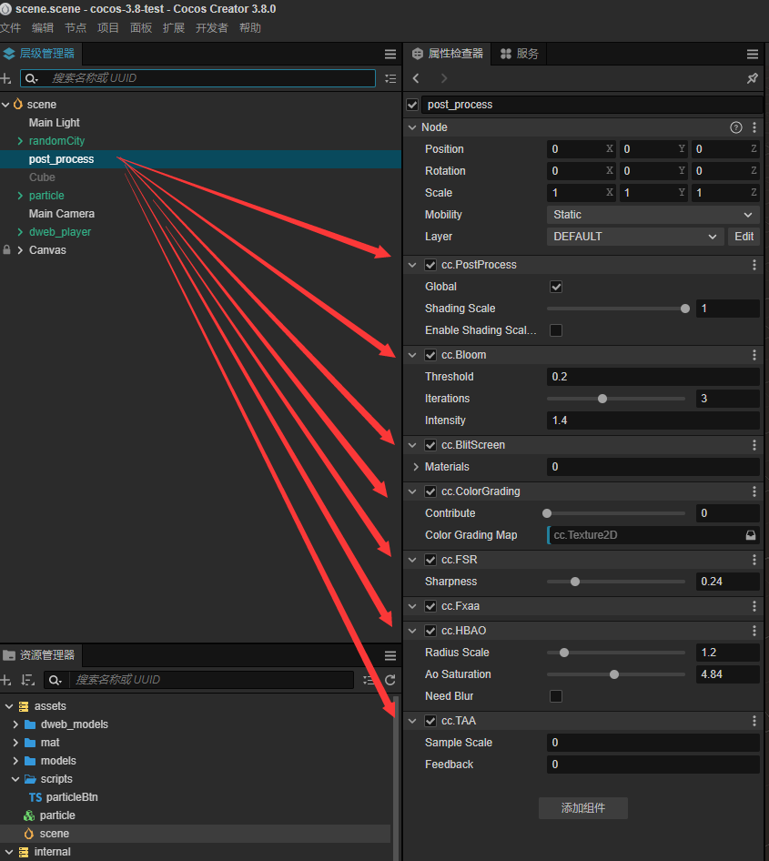

##### 5.还有一些例子

当引擎的能力足够规范和给力，开发者就有精力做更多有趣的事情了。
比如...一直想学习一下3D游戏开发中的特效。
现在有了Bloom后效，相信就算咱做的不好看，但光足啊！

比如...

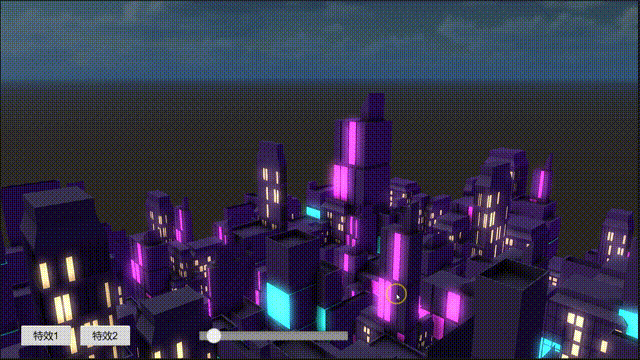

目前3.8版本还在公测中，写DEMO的时候没有找到如何通过脚本控制后效参数的方法。
希望后续更新能够支持，这样我就可以把后效做到游戏中...或者直接做动画!!!

个人主页：https://www.dweb.club
B站主页：https://space.bilibili.com/22690066

